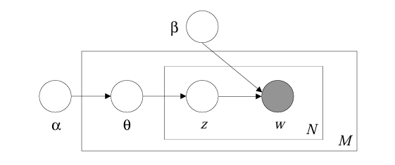
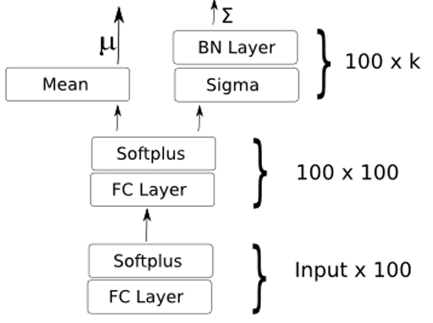

## Latent Diriclet Allocation (LDA)
This project explores Latent Dirichlet Allocation (LDA), applied to the [BBC News dataset](https://www.kaggle.com/datasets/hgultekin/bbcnewsarchive).
The dataset consists of 2,225 news articles from the BBC website, covering five topical categories: business, entertainment, politics, sport, and tech, published between 2004 and 2005.

The choice of this dataset is influenced by the computational resources available, as both data preprocessing and model training were performed on a NVIDIA GeForce RTX 4060 Laptop GPU.

The primary objective of this project is to identify latent topics in these news articles through topic modeling.
To achieve this, we employ LDA, a classical technique in Natural Language Processing (NLP), alongside ProdLDA, an advanced variation of LDA that leverages the product of experts to enhance the interpretability of the extracted topics.

Once the topic distributions are computed, they will be visualized and analyzed to gain insights into the main themes present in the dataset.
## Project structure

```bash
TopicModelComparison/
│
├── data/
│   ├── input/                  # Data ready for preprocessing
│   ├── raw/                    # Raw, unprocessed data (optional)
│   └── processed/              # Processed and cleaned data ready for modeling
│
├── images/                     # Images used in the README
│   
├── notebooks/
│   ├── EDA&PREPROC.ipynb       # Exploratory Data Analysis (EDA) and data preprocessing 
│   ├── LDA_BBC.ipynb           # Jupyter notebook for LDA experiments and testing
│   └── PROD_BBC.ipynb          # Jupyter notebook for ProdLDA experiments and testing
│
├── papers/
│   ├──OCTIS.pdf                # Main paper for  OCTIS library (OCTIS)
│   ├──LDA.pdf                  # Main paper for Latent Dirichlet Allocation (LDA)
│   ├──ProdLDA.pdf              # Main paper for Product of experts LDA (ProdLDA)
│   └──TM_Survey.pdf            # Paper containing a survey for topic model techniques
│
├── preprocessing/
│   ├── __init__.py             # Initialize the preprocessing package
│   └── clean_text.py           # Text cleaning, tokenization, stopword removal, etc.
│
├── requirements/
│   ├── environment.yml 
│   └── requirements.txt
│
├── results/
│   ├── test_LDA/               # Results of LDA model 
│   └── test_ProdLDA/           # Results of ProdLDA model
├── utils/
│   ├── __init__.py             # Initialize the utils package
│   ├── graph_tools.py          # Helper functions to visualize results
│   └── package_handler.py      # Helper functions to manage packages
│
├── .gitignore                  # Files and directories to be ignored by git
│
└── README.md                   # Project documentation
```

## [OCTIS](references/OCTIS.pdf)
This project was mainly developed using the OCTIS library, a python library thought to facilitate the comparison of topic modelling techniques.
There are adequate tools to preprocess the data, train the models, evaluate them and visualize the results.
Both LDA and ProdLDA were pre-implemented in the octis library, with refernce to the original papers.

## Pre-processing
We used the [SpaCy library](https://spacy.io/usage/linguistic-features) to remove stopwords, numeric chars and punctuation, along with a custom function to pre-treat sentences.
We also added some custom stopwords that were not present in the SpaCy library, such as ....
These words, while normally present in news articles, are irrelevant for distinguishing topics from one another.
After these steps, we leveraged a custom function to build the corpus and the labels in the format required by the [OCTIS library](https://github.com/MIND-Lab/OCTIS/tree/master/octis).
Finally we leveraged the OCTIS preprocessing tool for lemmatization and tokenization, while keeping only words with more than three characters, minimum ten appearances in the dataset and maximum frequency of 0.85.

## [LDA applied to BBC news articles](notebooks/LDA_BBC.ipynb)
Latent Dirichlet Allocation (LDA) is a generative probabilistic model that discovers hidden topics in a collection of documents by assuming each document is a mixture of topics, and each topic is a distribution over words.
The model is based on the bag of words assumption and the De Finetti exchangeability theorem. 
Its latent variables are the topic-word distribution and the document-topic distribution.
The following is the representation of the model as a pgm:




In our case we used the [OCTIS implementation of LDA](https://github.com/MIND-Lab/OCTIS/blob/master/octis/models/LDA.py) that is based on its corresponding implementation in gensim.
The model parameters are:
- num_topics: the number of topics to identify in the data
- alpha: the prior on the document topic distribution
- passes: the number of passes through the corpus
- iterations: the number of iterations for inference for each document
- update_every: the number of documents to process before updating the model parameters
- chunksize: the number of documents to use in each iteration

### Metrics
The metrics we chose to evaluate this model and also the ProdLDA model are topic coherence and topic diversity.
Topic coherence is a measure of how interpretable the topics are, it is a value between 0 and 1 where 1 is the best value, while topic diversity is a measure of how different the topics are from one another and it is also on a scale from 0 to 1.
Specifically it's defined as the ratio of the number of unique words in the topics to the total number of words in the topics.
There is a trade-off between these two metrics, as increasing the number of topics will increase the diversity but decrease the coherence of the topics.

Given the nature of this task, human judgement is also important to evaluate the topics identified by the model which is why we plotted the word clouds and the top 10 word distibution for each topic.

##Add mathemathical formulation?


#TODO: Discusss hyperparamenter tuning, choice of number of topics


#TODO: add topic distributions and word clouds, try to intepret


## [ProdLDA](references/ProdLDA.pdf) 
ProdLDA is a variation of LDA that leverages the product of experts to enhance the interpretability of the extracted topics.
The model assumes that each word in a document is generated by a single topic, and the topic distribution is obtained through a product of experts.

The variational inference algorithm for ProdLDA is based on Autoencoding Variational Bayes (AEVB), a generalization of the Variational Autoencoder (VAE) algorithm. This approach is referred to in the paper as Autoencoding Variational Inference for Topic Models (AVITM).

The key innovation of ProdLDA lies in its use of a neural network to model the topic distribution, enabling the discovery of more complex relationships between topics and words than traditional LDA. Additionally, this neural inference network significantly reduces computational time compared to standard LDA models, as topic proportions can be inferred in a single forward pass rather than requiring iterative optimization.
The following is the architecture used to train the model:




In our case we used the [OCTIS implementation of ProdLDA](https://github.com/MIND-Lab/OCTIS/blob/master/octis/models/ProdLDA.py) that is based on the implementation from the original paper.
The model parameters are:
- num_topics: the number of topics to identify in the data
- activation: the activation function for the neural network 
- dropout: the dropout rate for the neural network
- learn_priors: whether to learn the priors or not 
- batch_size: the size of the batch used for training
- lr: the learning rate for the optimizer
- momentum: the momentum for the optimizer
- solver : the optimizer used for training 
- num_epochs: the number of epochs for training
- reduce_on_plateau: whether to reduce the learning rate on plateau or not 
- prior_mean: the mean of the prior distribution
- prior_variance: the variance of the prior distribution
- num_layers: the number of layers in the neural network 
- num_neurons: the number of neurons in each layer of the neural network
- num_samples: number of samples used for estimating the ELBO
- use_partitions: whether to use partitions or not

#TODO: comment on hyperparameter tuning

## Conclusions


## Conda environment setup
There is a [.yml file](environment.yml) containing all the neccesary packages to run the code we developed.
Some useful commands:
* Exporting environment:
  ```
  conda env export --from-history > environment.yml
  ```
 
* Recreating environment:
  ```
  conda env create -f environment.yml
  ```
* Updating environment:
  ```
  conda env update -f environment.yml --prune
  ```
  
## References
- [Latent Dirichlet Allocation, Blei et. alt. (2003);](/References/Main_paper.pdf)
- [Latent Dirichlet allocation (LDA) and topic modeling: models, applications, a survey, Jelodar et alt. (2018);](/References/LDA_survey.pdf)
- [Autoencoding Variational Inference for topic models, Srivastava and Sutton (2017);](references/ProdLDA.pdf)
- [OCTIS: Comparing and Optimizing Topic Models is Simple!, Terragni et al. (2021)](references/OCTIS.pdf)


## Authors
- [Nicola Cortinovis](https://github.com/NicolaCortinovis)
- [Edoardo Cortolezzis](https://github.com/EdoardoCortolezzis)
- [Marta Lucas](https://github.com/15Max)

Checkout our brief [presentation](presentation.pdf) for a quick overview of the project. #TODO: add corect link